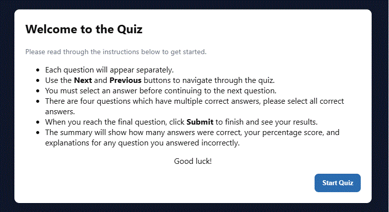
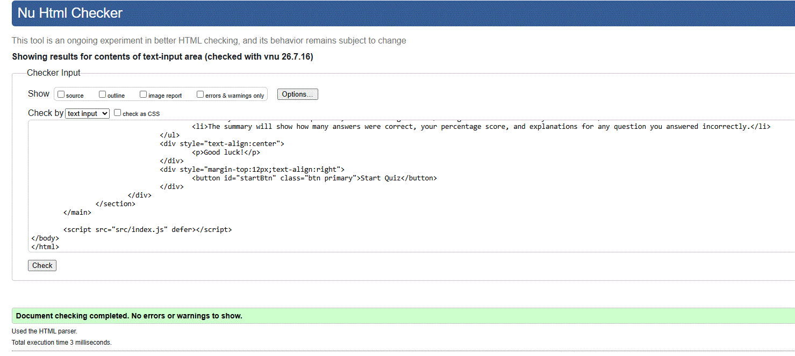
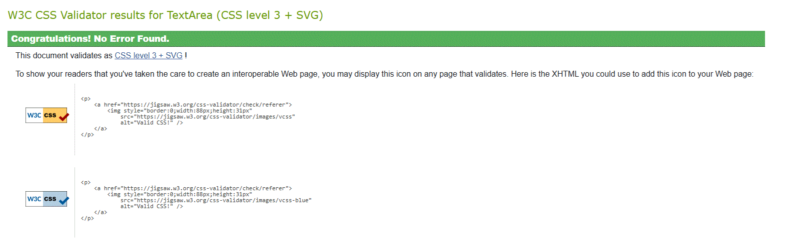
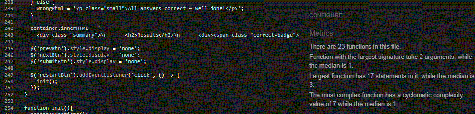

# Online Quiz
<p>Welcome to my web quiz, with questions covering science, technology, literature and general knowledge.</p>
<p>This README file provides essential information about the website and it's purpose.</p>

The website can be accessed by this [Link](https://rich-t-biscuit.github.io/Quiz/)

## Introduction
<p>The quiz will allow users to test their knowledge, learn something new and check their results after completion of the quiz.</p>

## Features
<p><b>Complete this section</b></p>

## Technologies Used
<p>Built with the following technologies:</p>

- HTML5 was used as the foundation of the site.
- CSS3 was used to add the styles and layout of the site.
- JavaScript (ES6) was used to create all the logic necessary to make the quiz work.
- GitHub was used to host the code of the website.
- GitHub Pages was used to deploy the website.

## Project Structure
```
Quiz/
│
├── index.html
├── src/
│   └── index.css
│   └── index.js
│
└── images/
```

## Testing
<p><b>Add screenshots & commentary for different sizes</b></p>

------------------------

<p>Alongside friends and family test running my quiz to check for accessibility and errors, I utilised the below websites to test code written in HTML, CSS and JavaScript.</p>

------------------------
<br>HTML testing was done through [https://validator.w3.rg/#validate\_by\_input](https://validator.w3.org/detailed.html#validate-by-input).

**Initial testing showed multiple warnings:**

<br>
**1)** Info: Trailing slash on void elements has no effect and interacts badly with unquoted attribute values.

An error had been made with the closing bracket at the end of the code:

`<meta charset="utf-8">`

**2)** Info: Trailing slash on void elements has no effect and interacts badly with unquoted attribute values.

An error had been made with the closing bracket at the end of the code:

`<meta name="viewport" content="width=device-width,initial-scale=1">`

**3)** Warning: Section lacks heading. Consider using h2-h6 elements to add identifying headings to all sections.

To aid accessibility, this was fixed by adding a hidden header:

`&lt;h2 class="visually-hidden"&gt;Quiz Application&lt;/h2&gt;`

<br>



------------------------------------------

CSS testing was done through [https://jigsaw.w3.org/css-validator/#validate_by_input](https://jigsaw.w3.org/css-validator/validator).



------------------------------------------

JavaScript testing was done through [https://jshint.com/](https://jshint.com/).



------------------------------------------

Color contrast testing was done through [https://coolors.co/contrast-checker/111111-ffffff](https://coolors.co/contrast-checker/111111-ffffff).

<p>Check Card</p>

<p>Background</p>


-----------------------------------------

## License

## Author + Link to GitHub
